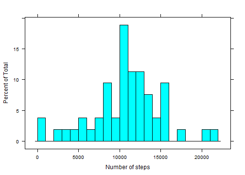
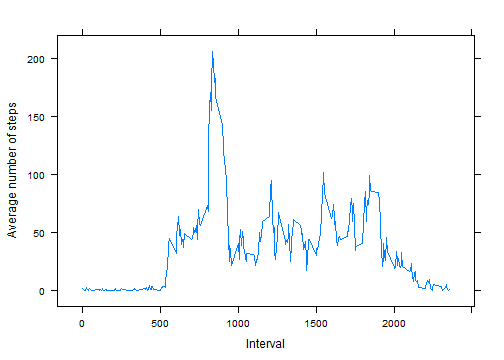
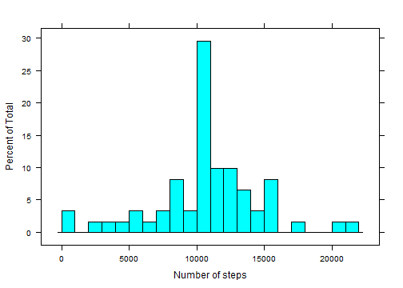

Activity Monitoring Data Analysis
=================================

## Introduction

It is now possible to collect a large amount of data about personal movement 
using activity monitoring devices such as a [Fitbit](http://www.fitbit.com/), 
[Nike Fuelband](http://www.nike.com/us/en_us/c/nikeplus-fuelband), or 
[Jawbone Up](https://jawbone.com/up). These type of devices are part of the 
"quantified self" movement - a group of enthusiasts who take measurements about 
themselves regularly to improve their health, to find patterns in their 
behavior, or because they are tech geeks. 

This document is going to process and interpret the data from a personal 
activity monitoring device. This device collects data at 5 minute intervals 
through out the day. The data consists of two months of data from an anonymous 
individual collected during the months of October and November, 2012 and include
the number of steps taken in 5 minute intervals each day.

## Data

The variables included in this dataset are:

+ **steps**: Number of steps taking in a 5-minute interval 
(missing values are coded as `NA`)
+ **date**: The date on which the measurement was taken in YYYY-MM-DD format
+ **interval**: Identifier for the 5-minute interval in which measurement was 
taken

The dataset is stored in a comma-separated-value (CSV) file (`actividy.csv`) and 
there are a total of 17,568 observations in this dataset.

## Analysis

### Loading and preprocessing the data


```r
act.data <- read.csv("activity.csv", colClass = c("numeric", "Date", "numeric"))
```

### Mean of total number of steps taken per day

Calculate total number of steps taken per day and polt the histogram of it:


```r
date.steps <- aggregate(steps ~ date, data = act.data, sum)

library(lattice)
histogram(~ steps, data = date.steps, breaks = 20, xlab = "Number of steps")
```

 

Calculate the mean and median of total number of steps taken per day:


```r
mean.date.steps <- mean(date.steps$steps)
median.date.steps <- median(date.steps$steps)
```

The mean of total steps per day is **1.0766 &times; 10<sup>4</sup>** and median is 
**1.0765 &times; 10<sup>4</sup>**.

### Average daily activity pattern

Calculate the average number of steps taken of each 5-minute interval and plot a
series plot of the 5-minute interval (x-axis) and the average number of steps 
taken (y-axis):


```r
interval.steps <- aggregate(steps ~ interval, data = act.data, mean)

xyplot(steps ~ interval, data = interval.steps, 
       type = "l", xlab = "Interval", ylab = "Average number of steps")
```

 

Find the 5-minute interval whict contains the maximum average steps:


```r
max.interval.steps <- interval.steps[interval.steps$steps %in% 
                                         max(interval.steps$steps), ]
```

The 5-minute interval, which contains the maximum average steps, 
is **835**, witch average 
**206.1698**.

## Imputing missing values

There are a number of days/intervals where there are missing values (coded as NA). The presence of missing days may introduce bias into some calculations or summaries of the data.

Calculate the total number of missing values in the dataset:


```r
na.rows <- act.data[is.na(act.data$steps), ]
na.row.num <- nrow(na.rows)
```

There are **2304** rows with NAs in the dataset.

Base on human's routines, we fill the NAs with mean of the 5-minute interval, 
and create a new dataset:


```r
library(plyr)
fixed <- join(na.rows, interval.steps, by = "interval", type = "left")

act.data.new <- act.data
act.data.new[is.na(act.data.new$steps), "steps"] <- fixed[4]
```

Plot histogram of the total number of steps taken each day of the new dataset:


```r
date.steps.new <- aggregate(steps ~ date, data = act.data.new, sum)

histogram(~ steps, data = date.steps.new, breaks = 20, xlab = "Number of steps")
```

 

Calculate the mean and median total number of steps taken per day of new dataset:


```r
mean.date.steps.new <- mean(date.steps.new$steps)
median.date.steps.new <- median(date.steps.new$steps)
```

The mean of total steps per day is **1.0766 &times; 10<sup>4</sup>** and median is 
**1.0766 &times; 10<sup>4</sup>**.

The impact of imputing missing data on the estimates of the total daily number 
of steps is very little.

## Weekdays v.s. weekends

Are there differences in activity patterns between weekdays and weekends?

Create a new factor variable in the new dataset with two levels - "weekday" and
"weekend" indicating whether a given date is a weekday or weekend day.


```r
weekday.map <- data.frame(weekday = c("Monday", "Tuesday", "Wednesday", 
                                      "Thursday", "Friday", "Saturday", 
                                      "Sunday"), 
                          type = c(rep("weekday", 5), rep("weekend", 2)))
act.data.new$weekday <- join(data.frame(weekday = weekdays(act.data.new$date)),
                             weekday.map, by = "weekday", type = "left")[, 2]
```

Plot to show differences in activity patterns between weekdays and weekends, by 
the 5-minute interval (x-axis) and the average number of steps taken, averaged 
across all weekday days or weekend days (y-axis):


```r
interval.steps.new <- aggregate(steps ~ interval + weekday, 
                                data = act.data.new, mean)

xyplot(steps ~ interval | weekday, data = interval.steps.new,
       type = "l", layout = c(1, 2),
       ylab = "Number of steps", 
       xlab = "Interval")
```

 

As we expected, we can see:

+ people get up and relax late as weekends
+ there are to concentrate time intervals in weekdays, which people go to work 
in the morning and come home in evening


